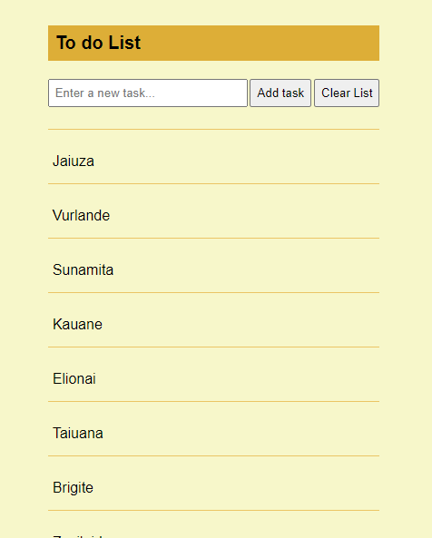

# To do list

Este projeto, ajuda o usuário a criar uma lista de tarefas.

## Detalhes

- Criação de nova tarefa: Permite adicionar novas tarefas à lista. ✅

- Marcação como completo ao clicar na tarefa: Clique em uma tarefa para marcá-la como concluída. ✅

- Edição de tarefa já criada: Permite editar o texto de uma tarefa existente. ✅

- Remoção de tarefa específica ou remoção total: Remova uma tarefa específica ou todas as tarefas de uma vez. ✅

- Armazenamento em Local Storage para carregar tarefas ao reabrir a página: As tarefas são carregadas do Local Storage ao reabrir a página. ✅

- Foco no input, quando remover uma task: O foco é automaticamente colocado no campo de entrada ao remover uma tarefa. ✅

- Contador de caracteres digitados no input da tarefa: Exibe o número de caracteres digitados no campo de entrada da tarefa. ✅

- Correção do fechamento do menu em telas pequenas: Corrige o comportamento do menu em dispositivos móveis. ✅

- Remover a possibilidade de clicar no botão Clear list, quando o input estiver sendo preenchido: Desabilita o botão “Clear list” enquanto o campo de entrada está ativo. ✅

- Remover a possibilidade de clicar em outra task, durante a edição da task atual: Impede a seleção de outras tarefas enquanto uma tarefa está sendo editada. ✅

- Contador de caracteres digitados no input de editar tarefa: Exibe o número de caracteres digitados no campo de edição da tarefa. ✅

- Refatoração do código e distribuição em módulos: O código foi refatorado para melhorar a legibilidade e a manutenção. As funcionalidades foram distribuídas em módulos separados, facilitando a organização e a escalabilidade do projeto. ✅

### Tecnologias Utilizadas

- HTML
- CSS
- Javascript
